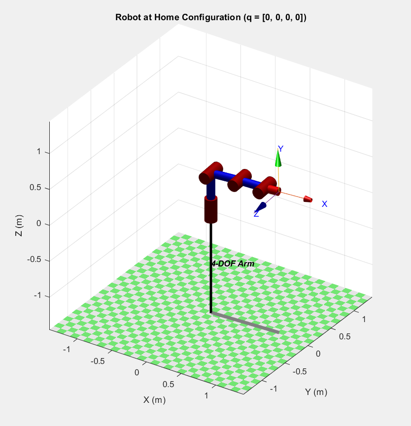
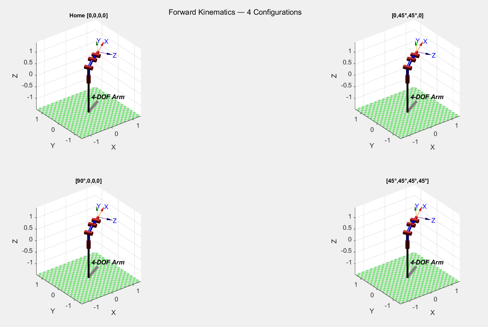
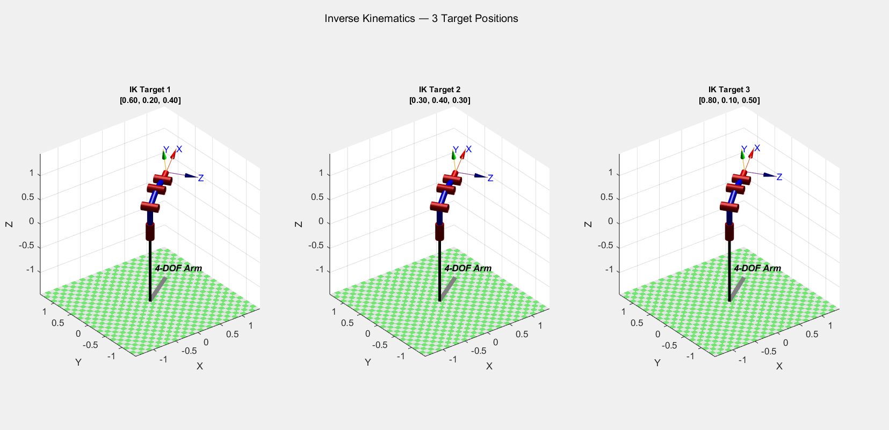
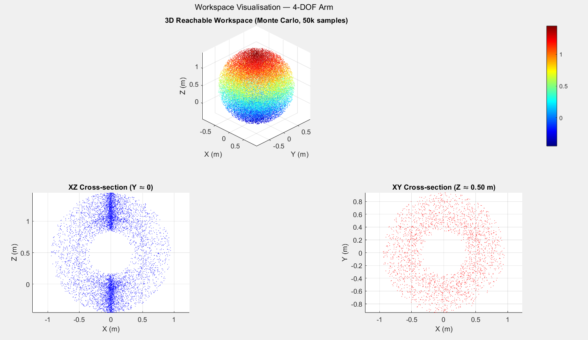
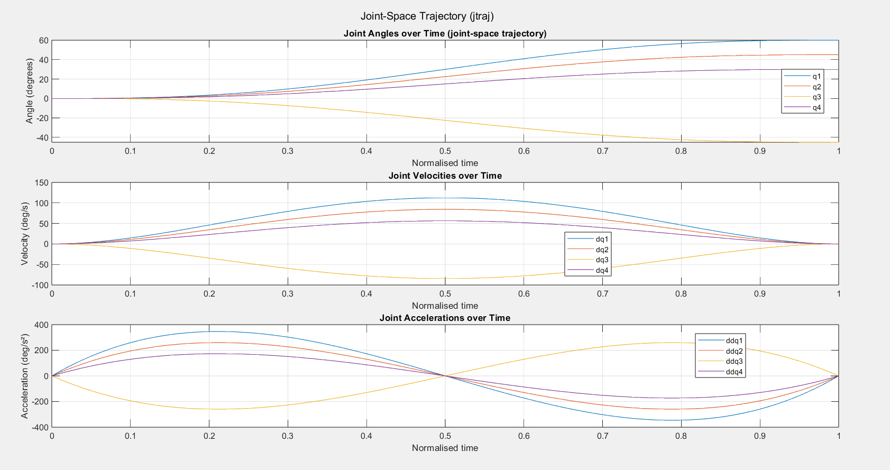
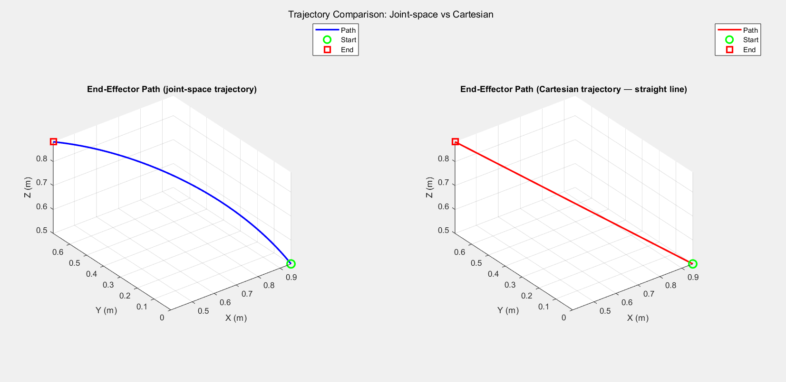
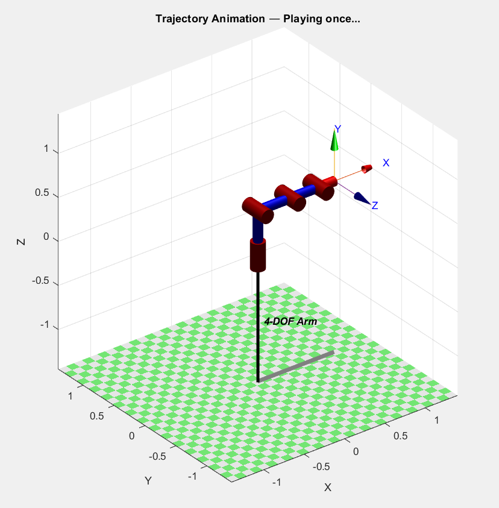
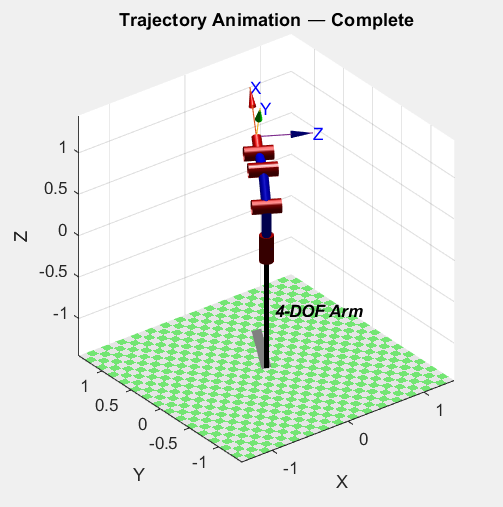
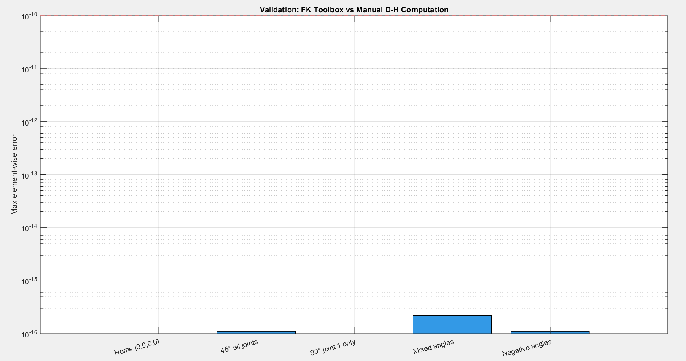

# 4-DOF Robotic Manipulator — Kinematic Modelling in MATLAB
### Using Peter Corke's Robotics Toolbox

---

## Quick Start

1. Install the Robotics Toolbox:
   - MATLAB → Home tab → Add-Ons → Get Add-Ons → search "Robotics Toolbox" by Peter Corke → Install

2. Open MATLAB and navigate to this project folder:
   - Home tab → Set Path → Add Folder → select this folder → Save

3. In the Command Window, type:
   ```
   main
   ```
   This runs all 6 phases in sequence and opens all figures.

---

## Project Files

| File | Phase | What it does |
|------|-------|-------------|
| `main.m` | — | Runs everything in order |
| `setup_robot.m` | 1 | Defines D-H parameters, creates SerialLink robot |
| `forward_kinematics.m` | 2 | Computes FK for 4 test configurations |
| `inverse_kinematics.m` | 3 | Computes IK for 3 target positions |
| `workspace_viz.m` | 4 | Monte Carlo workspace point cloud |
| `trajectory.m` | 5 | Joint-space and Cartesian trajectory planning |
| `validation.m` | 6 | Validates FK against manual D-H matrix math |

---

## D-H Parameters Used

| Link | a (m) | alpha (rad) | d (m) | Joint |
|------|--------|-------------|--------|-------|
| 1    | 0.000  | π/2         | 0.500  | q1 (shoulder rotation) |
| 2    | 0.400  | 0           | 0.000  | q2 (upper arm) |
| 3    | 0.350  | 0           | 0.000  | q3 (forearm) |
| 4    | 0.200  | 0           | 0.000  | q4 (wrist) |

---

## Expected Outputs

- **Figure 1** — Robot at home position
- **Figure 2** — 4 FK configurations (2×2 subplot)
- **Figure 3** — 3 IK solutions
- **Figure 4** — Workspace point cloud + cross-sections
- **Figure 5** — Joint angle / velocity / acceleration profiles
- **Figure 6** — Cartesian path comparison
- **Figure 7** — Animated trajectory
- **Figure 8** — Validation error bar chart

---

## Figures

<p align="center">
  
  <br>
  <em>Fig.1: Robot at home position</em>
</p>

<p align="center">
  
  <br>
  <em>Fig.2: Forward Kinematics configurations</em>
</p>

<p align="center">
  
  <br>
  <em>Fig.3:Inverse Kinematics solutions</em>
</p>

<p align="center">
  
  <br>
  <em>Fig.4: Reachable Workspace</em>
</p>

<p align="center">
  
  <br>
  <em>Fig.5:Joint Space Trajectory</em>
</p>

<p align="center">
  
  <br>
  <em>Fig.6: Trajectory Comparisson</em>
</p>

<p align="center">
  
  <br>
  <em>Fig.7: Animating Trajectory</em>
</p>

<p align="center">
  
  <br>
  <em>Fig.7: Completed Trajectory Animation</em>
</p>

<p align="center">
  
  <br>
  <em>Fig.8: Validated Results</em>
</p>

---

## Running Individual Phases

You can also run scripts one at a time. In the Command Window:

```matlab
robot = setup_robot();          % Always run this first
forward_kinematics(robot);
inverse_kinematics(robot);
workspace_viz(robot);
trajectory(robot);
validation(robot);
```

---

## Troubleshooting

| Problem | Fix |
|---------|-----|
| `Undefined function 'SerialLink'` | Robotics Toolbox not installed or not on path |
| IK solution fails | Target may be outside workspace; try a closer target |
| Figures don't open | Run `close all` then try again |
| `transl` not found | Make sure Robotics Toolbox is on the MATLAB path |
